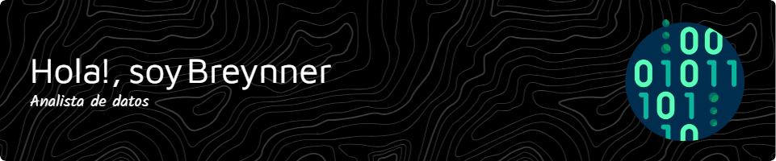

Estudiante de ciencias de la computación | Interés en análisis de datos y Machine Learning 🤖 | Real Madrid
***

## ⚡ Datos rápidos sobre mí:

- 🌱 Estoy aprendiendo nuevas técnicas de
 visualización y **análisis de datos**.
- Estoy implementando modelos matemáticos 
de **Machine Learning** en *python*.

- 📫 contacto: jhonguzmansanchez@gmail.com
- ⚡fun fact:

## Algunas herramientas que uso

<!--
**BREYNNER88/BREYNNER88** is a ✨ _special_ ✨ repository because its `README.md` (this file) appears on your GitHub profile.

Here are some ideas to get you started:

- 🔭 I’m currently working on ...
- 🌱 I’m currently learning ...
- 👯 I’m looking to collaborate on ...
- 🤔 I’m looking for help with ...
- 💬 Ask me about ...
- 📫 How to reach me: ...
- 😄 Pronouns: ...
- ⚡ Fun fact: ...
-->
